# Himatech

**Contents**

<a href="#about">About</a><br>
<a href="#technologies-used">Technologies Used</a><br>
<a href="#features">Features</a><br>
<a href="#credits">Credits</a><br>

## About

An e-commerce web-app project developed using flask, where an end-user can register, login into their account,
add products to their cart or wishlist and view their purchased items

## Technologies Used

+ Flask
+ SQL(SQLite for development)
+ Javascript
+ HTML/CSS
+ Git - for version control

## Features

+ **Dynamic Routes**<br>

	Creating Dynamic routes for products based on their categories, which is retrieved from a backend database.

	**Code**

	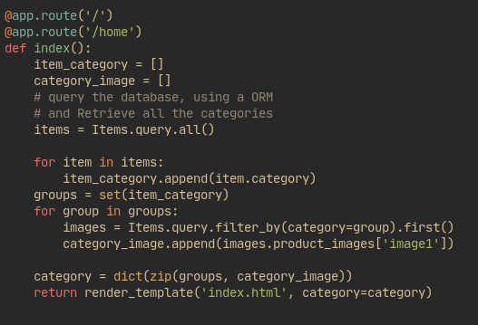

	**Output**

	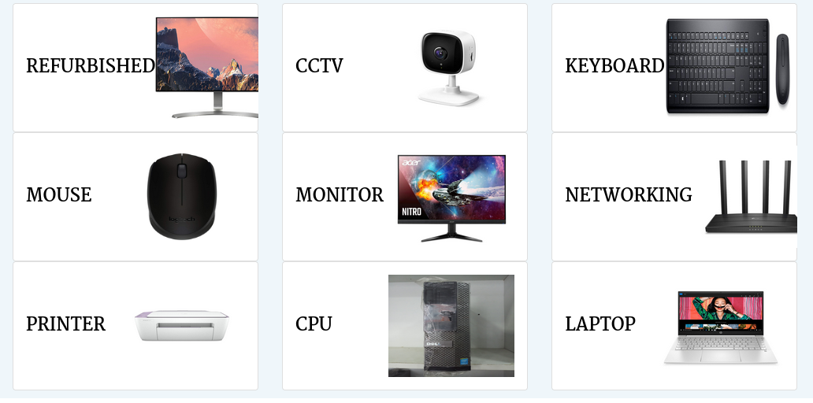

+ **Login and Register System**

	An end user can login and Register, and all user inputs are validated

	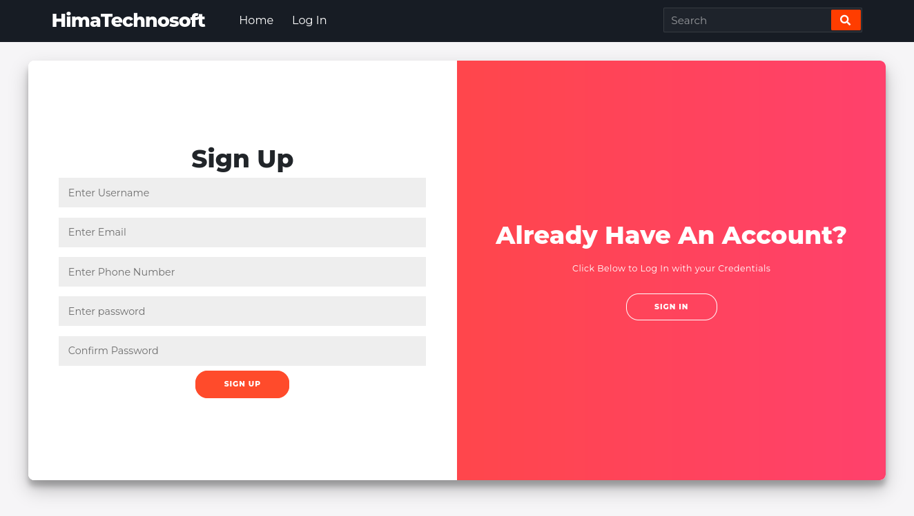

	**Validation**

	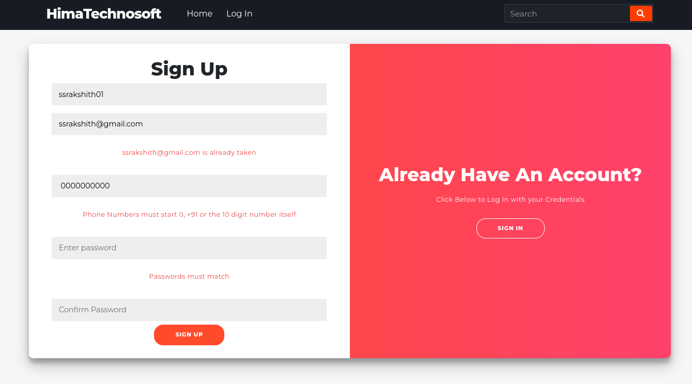

+ **Wishlist and Cart Page**

	Adding, removing and clearing cart in wishlist and cart pages

	**Wishlist Page**

	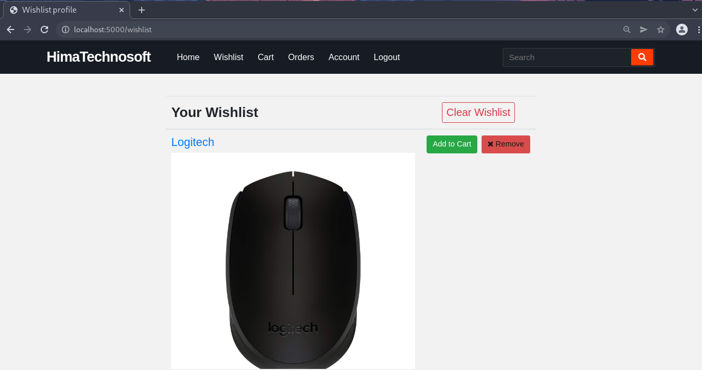

 	**Cart Page**

	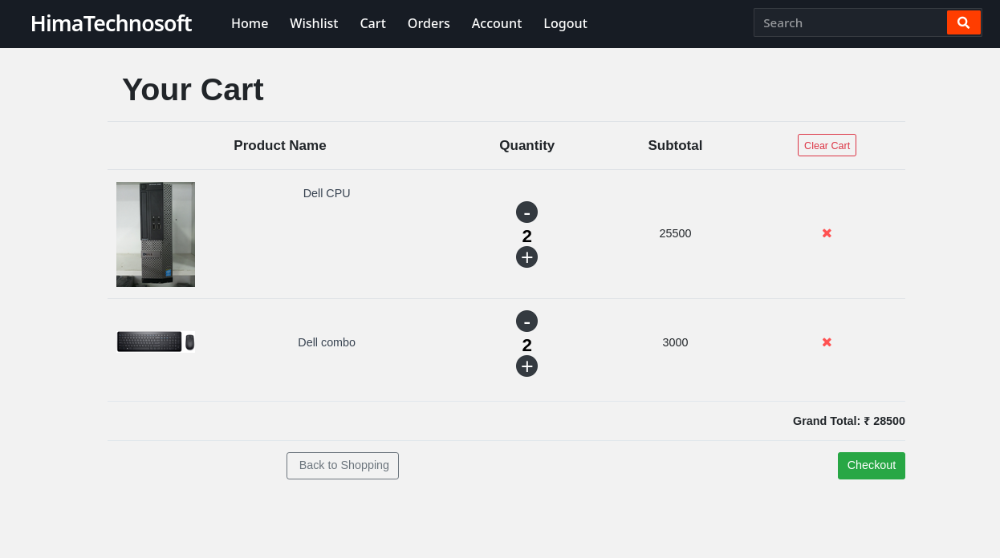

	Adding a product, to cart through wishlist, on doing so renders a flash message

	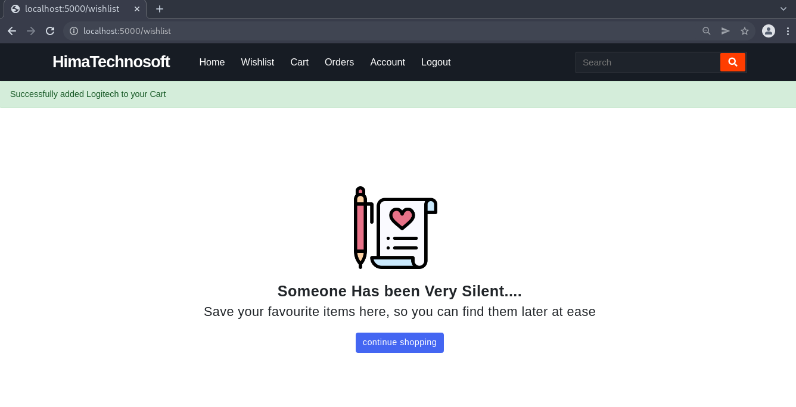

	Removing a product from a cart

	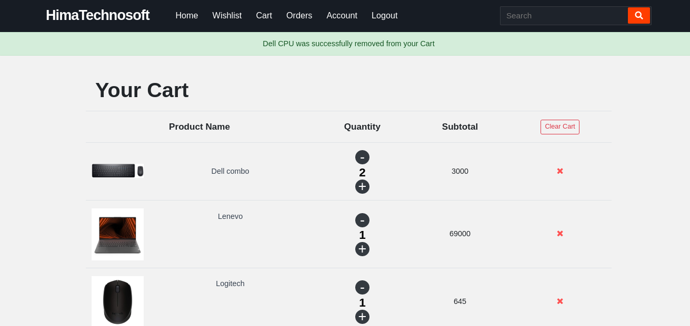

+ **Product Detail**

	A description of each product, that is retrieved from a database

	**code snippet**

	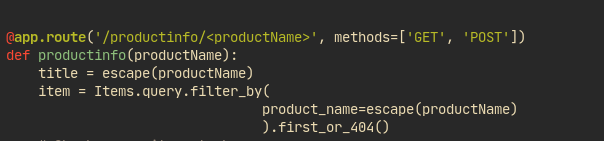

	**Output**

	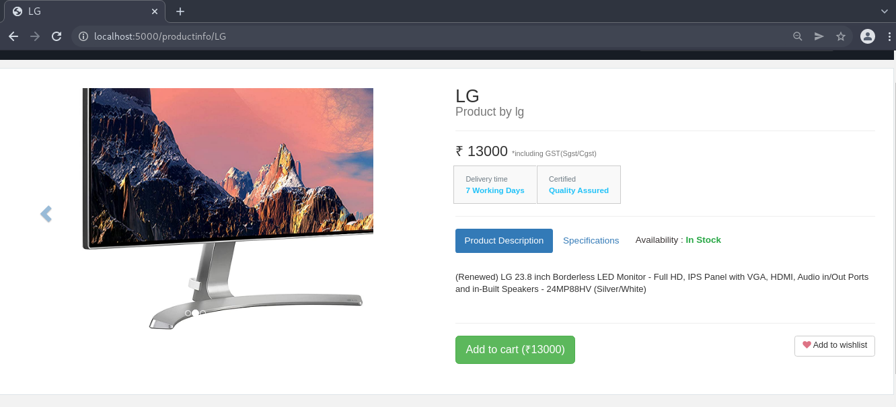

+ **Checkout Page**

	Billing page

	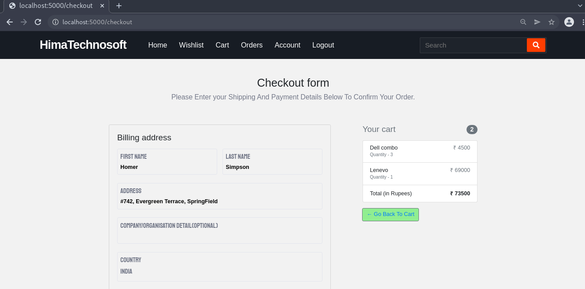

+ **Orders Page**

	An end-user can, view their orders

	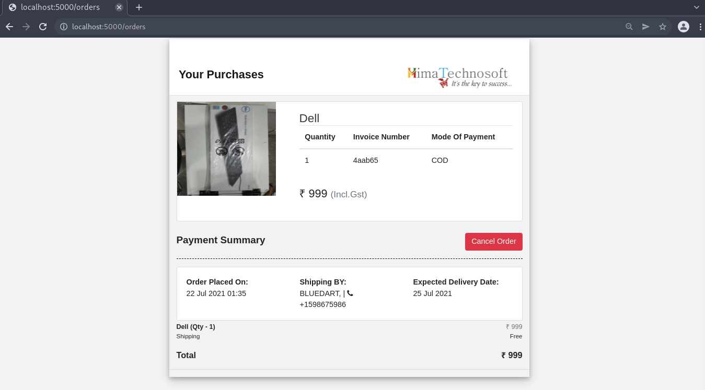


## Running the web-app

+ In order to run this web-app, python3 must be installed

1. Clone the repo using git and cd into the repo

```
git clone https://github.com/Rakshith-SS/himatech.git

cd himatech
```

2. Install the python requirements via pip

``` python
python3 -m pip install -r requirements.txt
```

3. Running the web-app.

```python
python run.py
```

## Credits

Thanks [Sagar](https://github.com/sagar-sagar) and [Vishwas](https://github.com/vvs2001) for contributing to the front-end work
